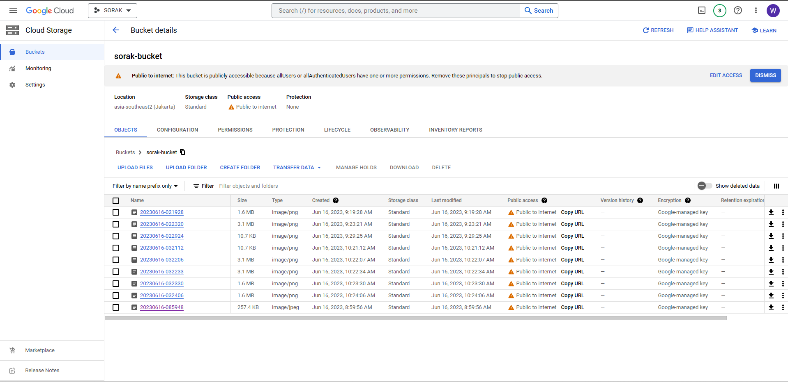
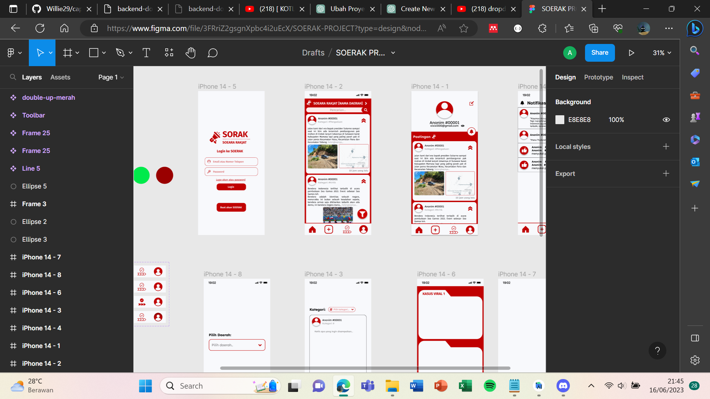
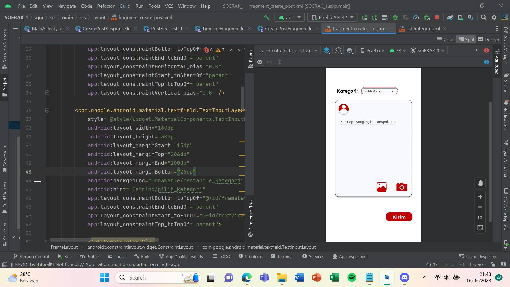
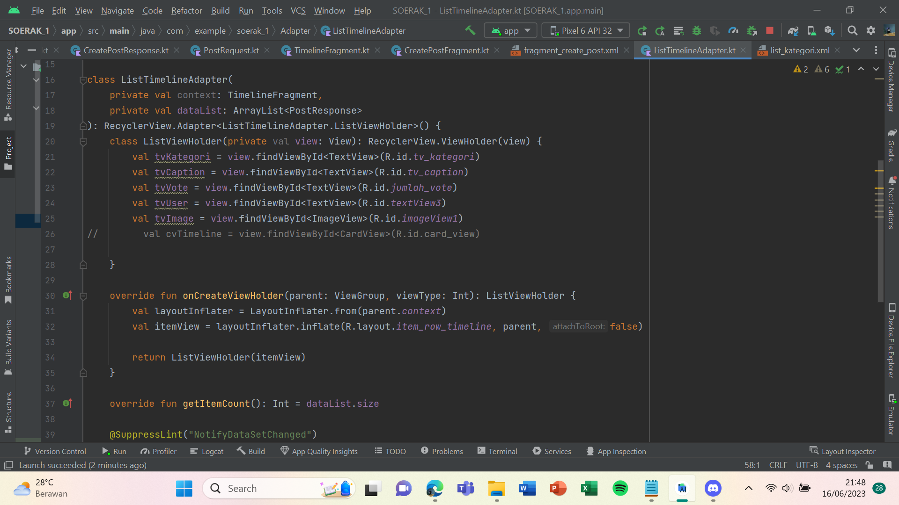
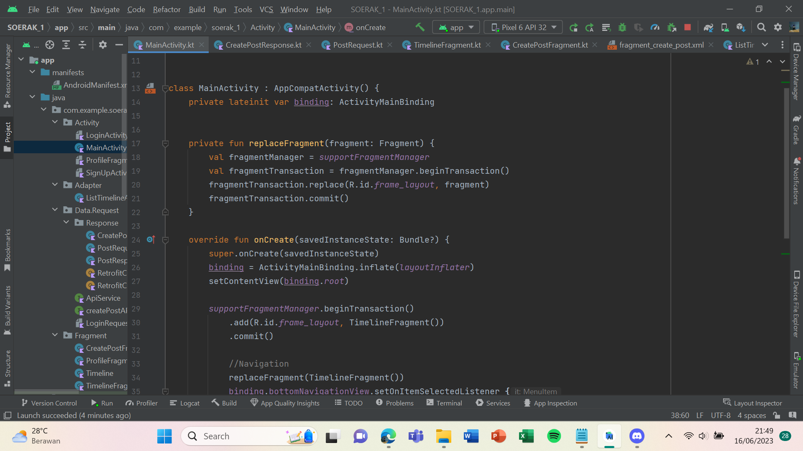
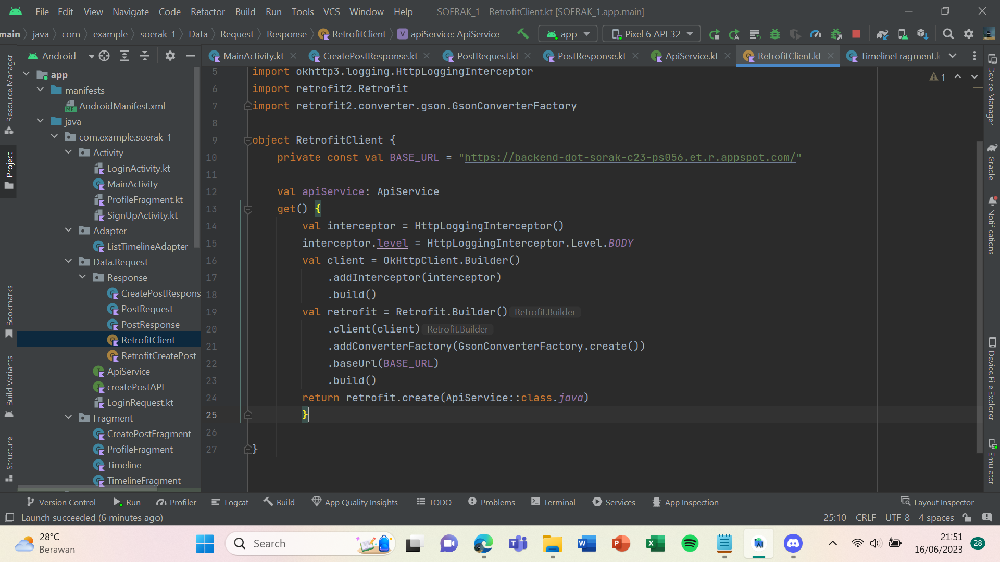

# Capstone-C23-PS056
# Title : Sorak (Soeara Rakyat)

## <b>Members</b> 
1. (MD) A166DKY4343 – Alma Alifia Halimatunnisa – Universitas Diponegoro - [Active]
2. (CC) C166DSX3027 – Fariel Ahmad Sudrajat– Universitas Diponegoro - [Active]
3. (CC) C303DSX2618 – Willyam Dyanata – Universitas Pelita Harapan - [Active] 
4. (ML) M166DSX2489 –Ibrahim Erlangga – Universitas Diponegoro - [Active]
5. (ML) M303DKX3947 –Prapta Arya Therawan – Universitas Pelita Harapan - [Active]
6. (ML) M303DSX1882 – Rovario Khogus Limando – Universitas Pelita Harapan - [Active]

## Description
We're planning to make an application full with people's aspiration for the government. 

---
## Machine Learning
- Gathering Datasets of Indonesian's badword
- Making an NLP to detect a badword in the user's report.

### Step by Step

1. prepare data
2. cleaning data
3. parse data
4. create model
5. evaluate model
6. export model

<br>

---
## Cloud Computing
- Responsible for the backend of the app.
- Deploying the backend to the cloud using App Engine
- Set up a bucket to store image
- Set up databases for the app


### <b>Cloud Storage</b>
We're using the cloud storage to store the image from user's posts. We named it "sorak-bucket".


### <b>Cloud SQL</b>
We're using MySQL 8.0 for the database and we named it "sorak_db" which include 3 tables such as "users", "posts", and "votes".


### <b>Authentication</b>
We failed to build this.

### <b>Sorak - API</b>

#### Deployment

#### Endpoints list

<details>
 <summary>Add Post | <code>POST</code> <code><b>/post</b></code></summary>

#### URL

`/post`

#### Method

`POST`

#### Parameters

> | key                   | type     | data type | description |
> | --------------------- | -------- | --------- | ----------- |
> | user_id                  | required | string       | N/A         |
> | category                 | required | string    | N/A         |
> | caption                  | required | string       | N/A         |
> | attachment                 | required | .img, .png    | N/A         |
</details>

<details>
 <summary>Save Vote| <code>POST</code> <code><b>/vote</b></code></summary>

#### URL

`/vote`

#### Method

`POST`

#### Parameters

`user_id, post_id`

 </details>

<details>
 <summary>Get Post by Vote | <code>GET</code> <code><b>/post/byvote</b></code></summary>

#### URL

`/post/byvote`

#### Method

`GET`

#### Parameters

`N/A`

#### Responses

status: `200 OK`

#### App engine link

https://backend-dot-sorak-c23-ps056.et.r.appspot.com/post/byvote

```json
[
    {
        "post_id": "post-lTQn3Tp6Y",
        "user_id": "user04",
        "category": "pengaduhan",
        "caption": "Tolong putung rokok sudah memenuhi taman ini.",
        "image_url": "https://storage.googleapis.com/sorak-bucket/20230616-032406",
        "createdAt": "2023-06-16T03:24:06.000Z",
        "vote": 5
    },
    {
        "post_id": "postHasVt2yCd8",
        "user_id": "user01",
        "category": "pengaduhan",
        "caption": "Pohon tumbang ini sudah 3 hari tidak ada tindak lanjut.",
        "image_url": "https://storage.googleapis.com/sorak-bucket/20230616-032112",
        "createdAt": "2023-06-16T03:21:12.000Z",
        "vote": 4
    },
    {
        "post_id": "postqKkKNzcvG_",
        "user_id": "user02",
        "category": "pengaduhan",
        "caption": "jalan  ini rusak mulu",
        "image_url": "https://storage.googleapis.com/sorak-bucket/20230616-032206",
        "createdAt": "2023-06-16T03:22:06.000Z",
        "vote": 3
    },
    {
        "post_id": "postQtGAhtZfF_",
        "user_id": "user03",
        "category": "aspirasi",
        "caption": "Flexing elit, mimpin sulit.",
        "image_url": "https://storage.googleapis.com/sorak-bucket/20230616-032330",
        "createdAt": "2023-06-16T03:23:30.000Z",
        "vote": 2
    },
    {
        "post_id": "postrNSYGudu88",
        "user_id": "user03",
        "category": "aspirasi",
        "caption": "kalau ada yang ribet kenapa harus yang gampang. CHUAKS",
        "image_url": "https://storage.googleapis.com/sorak-bucket/20230616-032233",
        "createdAt": "2023-06-16T03:22:33.000Z",
        "vote": 0
    }
]
```

</details>

<details>
 <summary>Get Post by Date | <code>GET</code> <code><b>/post/bydate</b></code></summary>

#### URL

`/post/bydate`

#### Method

`GET`

#### Parameters

`N/A`

#### Responses

status: `200 OK`

#### App engine link

https://backend-dot-sorak-c23-ps056.et.r.appspot.com/post/bydate

```json
[
    {
        "post_id": "post-lTQn3Tp6Y",
        "user_id": "user04",
        "category": "pengaduhan",
        "caption": "Tolong putung rokok sudah memenuhi taman ini.",
        "image_url": "https://storage.googleapis.com/sorak-bucket/20230616-032406",
        "createdAt": "2023-06-16T03:24:06.000Z",
        "vote": 5
    },
    {
        "post_id": "postQtGAhtZfF_",
        "user_id": "user03",
        "category": "aspirasi",
        "caption": "Flexing elit, mimpin sulit.",
        "image_url": "https://storage.googleapis.com/sorak-bucket/20230616-032330",
        "createdAt": "2023-06-16T03:23:30.000Z",
        "vote": 2
    },
    {
        "post_id": "postrNSYGudu88",
        "user_id": "user03",
        "category": "aspirasi",
        "caption": "kalau ada yang ribet kenapa harus yang gampang. CHUAKS",
        "image_url": "https://storage.googleapis.com/sorak-bucket/20230616-032233",
        "createdAt": "2023-06-16T03:22:33.000Z",
        "vote": 0
    },
    {
        "post_id": "postqKkKNzcvG_",
        "user_id": "user02",
        "category": "pengaduhan",
        "caption": "jalan  ini rusak mulu",
        "image_url": "https://storage.googleapis.com/sorak-bucket/20230616-032206",
        "createdAt": "2023-06-16T03:22:06.000Z",
        "vote": 3
    },
    {
        "post_id": "postHasVt2yCd8",
        "user_id": "user01",
        "category": "pengaduhan",
        "caption": "Pohon tumbang ini sudah 3 hari tidak ada tindak lanjut.",
        "image_url": "https://storage.googleapis.com/sorak-bucket/20230616-032112",
        "createdAt": "2023-06-16T03:21:12.000Z",
        "vote": 4
    }
]
```

</details>

<details>
 <summary>Get Post by ID | <code>GET</code> <code><b>/post/{post_id}</b></code></summary>

#### URL

`/post/{post_id}`

#### Method

`GET`

#### Parameters

`post_id`

#### Responses

status: `200 OK`

#### App engine link

https://backend-dot-sorak-c23-ps056.et.r.appspot.com/post/post-lTQn3Tp6Y

```json
{
    "post": {
        "post_id": "post-lTQn3Tp6Y",
        "user_id": "user04",
        "category": "pengaduhan",
        "caption": "Tolong putung rokok sudah memenuhi taman ini.",
        "image_url": "https://storage.googleapis.com/sorak-bucket/20230616-032406",
        "createdAt": "2023-06-16T03:24:06.000Z",
        "vote": 5
    }
}
```

</details><br>

---

## Mobile Development

### Design in Figma


<br>

### Layouting Process


<br>

### Adapter for TimelineFragment's RecyclerView


<br>

### Developing the Kotlin's files


<br>

### Deployment Files such as Retrofit, API Services, and Responses
